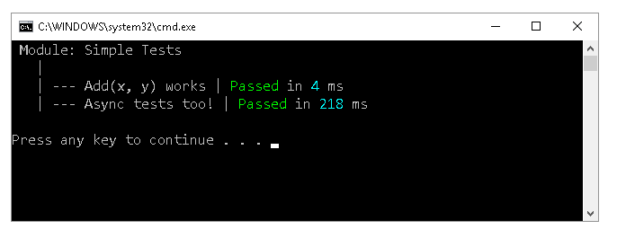

# TinyTest
Tiny single file test "framework" for small projects because you don't always need full fledged testing frameworks.

## Usage
 - Create a console project (the test runner)
 - Copy the file [TinyTest.cs](https://github.com/Zaid-Ajaj/TinyTest/blob/master/TinyTest.cs) to the project
 - Start writing tests
 
 ```csharp
using TinyTest;

class Program
{
    static int Add(int x, int y) => x + y;

    static int Main(string[] args)
    {
        Test.Module("Simple Tests");

        Test.Case("Add(x, y) works", () =>
        {
            var result = Enumerable.Range(1, 100).Aggregate(Add);
            Test.Equal(result, 5050);
        });

        Test.CaseAsync("Async tests too!", async () =>
        {
            await Task.Delay(200);
            Test.Equal(1, 1);
        });

        return Test.Report();
    }
}
```
Test Results:




## Grouping tests
You can group tests using modules:
```csharp
Test.Module("Math tests");
Test.Case("Case 1", () => ... );
Test.Case("Case 2", () => ... );

Test.Module("Database tests");
Test.Case("Case 1", () => ... );
Test.Case("Case 2", () => ... );

Test.Report();
``` 
## Test reporters

You can implement your own test reporters easily. The call `Test.Report()` only calls `Test.ReportUsing(new ConsoleReporter())` where `ConsoleReporter` is an `ITestReporter`. i.e.:
```csharp
public interface ITestReporter
{
    void Report(IEnumerable<TestModule> modules); 
}

public class ConsoleReporter : ITestReporter
{
    /* ... */
}
```

